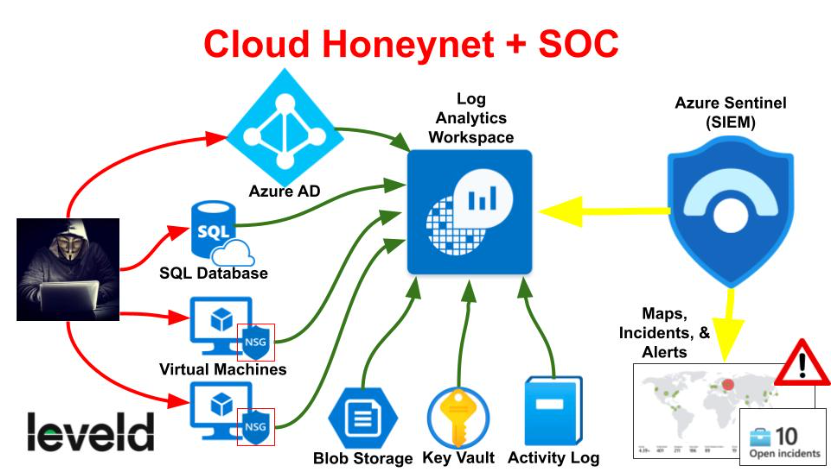
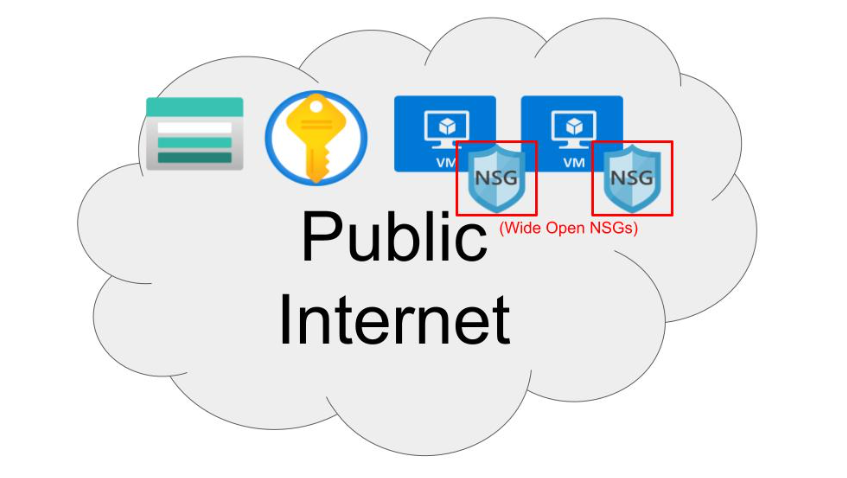
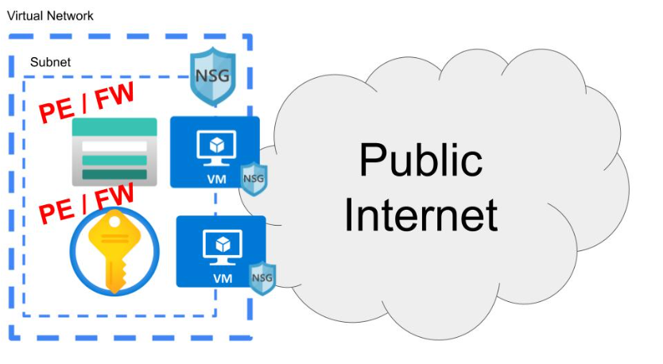
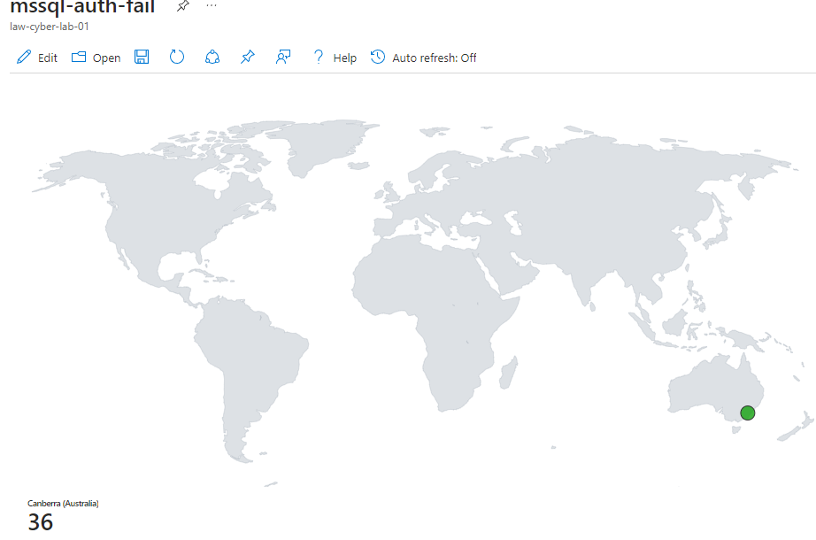
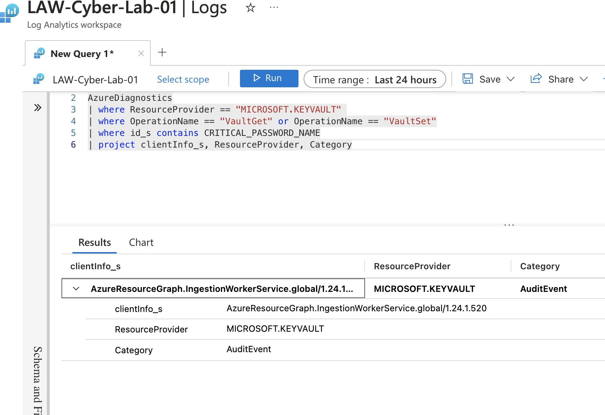

# Azure-Honeynet

## Introduction
To understand malicious attack patterns over the internet and the effectiveness of security measures, I created a honeynet and Security Operations Center (SOC) with Microsoft Azure.

The various log sources are ingested into a Log Analytics Workspace, which Microsoft Sentinel uses to build attack maps, trigger alerts, and create incidents.

I left the environment insecure for 24 hours and recorded the log data. Then I secured the environment and recorded log data for another 24 hours.

These are the metrics which were recorded:
- SecurityEvent (Windows Event Logs)
- Syslog (Linux Event Logs)
- SecurityAlert (Log Analytics Alerts Triggered)
- SecurityIncident (Incidents created by Sentinel)
- AzureNetworkAnalytics_CL (Malicious Flows allowed into our honeynet)

## Architecture Before Hardening

The honeynet consists of:
- Virtual Network (VNet)
- Network Security Group (NSG) with inbound rules allowing ALL access
- Virtual Machines (2 windows, 1 linux)
- Log Analytics Workspace
- Azure Key Vault
- Azure Storage Account
- Microsoft Sentinel

## Architecture After Hardening

To stay compliant with NIST 800-53 guidelines, Microsoft Defender for Cloud has a "Regulatory Compliance" feature. There, you are able to see which guideline specifications your architecture complies or does not comply with.

To bring the system up to standards against the "SC-7 Boundary Protection" standard, I attached a an NSG to the subnet containing all resources and configured the inbound rules to only allow traffic from my IP address.

## Attack Maps Before Hardening
.png) 
.png) 
.png) 
 

## Attack Maps After Hardening
No maps were generated as attackers were not able to access the subnet due to the Network Security Group inbound rule, denying all traffic besides my IP.  

## Metrics

### Before Hardening

Start Time 2024-09-10 10:52:42
End Time 2024-09-10 10:52:42

| Metric                   | Count
| ------------------------ | -----
| SecurityEvent            | 40625
| Syslog                   | 6336
| SecurityAlert            | 237
| SecurityIncident         | 238
| AzureNetworkAnalytics_CL | 15039

### After Hardening

Start Time 2024-09-15 05:43:24
End Time 2024-09-16 05:43:24

| Metric                   | Count
| ------------------------ | -----
| SecurityEvent            | 17188
| Syslog                   | 3
| SecurityAlert            | 0
| SecurityIncident         | 30
| AzureNetworkAnalytics_CL | 0

## Conclusion
After securing the environment, the number of Security Events and and Incidents were drastically reduced. Although the system did receive 30 incidents (from the Custom alerts), I investigated the incidents to be a false positives. All of the 30 incidents were of the same "Possible Privilege Escalation (Azure Key Vault Critical Credential Retrieval or Update)" alert, triggered by the same IP (20.9.153.77). This IP links back to the Micrisoft Azure Data Center in region West-2 and is likely an internal service.

A quick check into the LAW (Log Analytics Workspace) is that it is indeed an Audit Event triggered an Azure Service.

 

So in total, Incidents and Alerts were reduced by effectively 100% all from primarily hardening the Network Security Groups. This means that secure inbound rules for your firewalls will significantly protect your systems from the constant malicious scripts/traffic acting across the public internet. 

